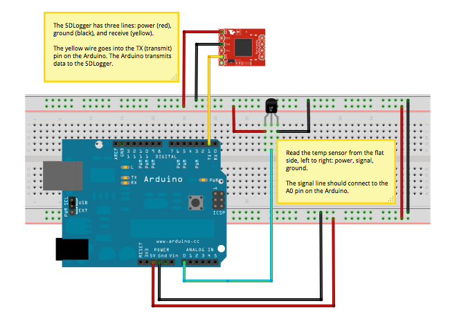

# Logging Temperature

This lab is intended to go quick-and-easy in terms of deployment.

## Build the Circuit

Below is a Fritzing diagram for the circuit. Build the equivalent circuit on a breadboard.

  

## Mount the Arduino

Mount the Arduino in an enclosure. I've provided you with materials to make an enclosure.

## Upload the Code

1. Launch Flow.
1. Select the "Temperature Logging" blockset.
1. Drag the only block you have available out.
1. Set the current time (eg. if it is 3:30PM, you should enter **15** for hours and **30** for minutes.)
1. Choose how often you want to collect data. I recommend once every **5** minutes.

## Deploy The Sensor

Choose a location in the building that you think will:

1. Be safe and
1. Be interesting

for logging temperature data. It is perfectly acceptable to have multiple sensors in one room.

You will need the USB power adapter from your toolbox to do the deployment.

## Wait.

Not done yet.

## Wait some more.

Really.

## Retrieval

We will retrieve our sensors on Monday, October 29th. This will give us data for both weekdays and a weekend; we can assume that we will see the temperature change in interesting ways over this course of time.

## Analysis and Writeup

*TBA*.

## Submission

*TBA*. Probably due by the end of Saturday, Nov 3rd.