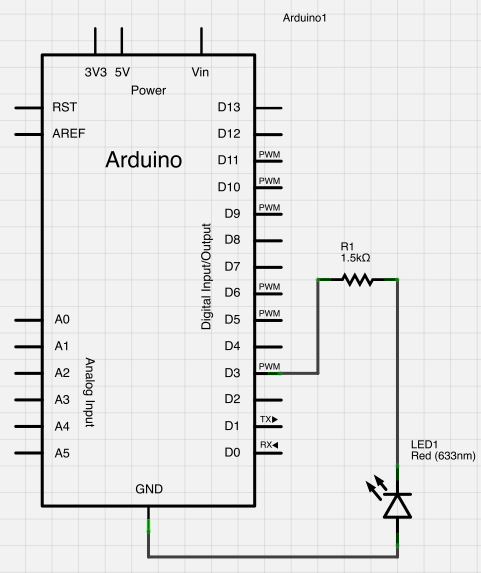
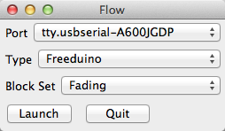
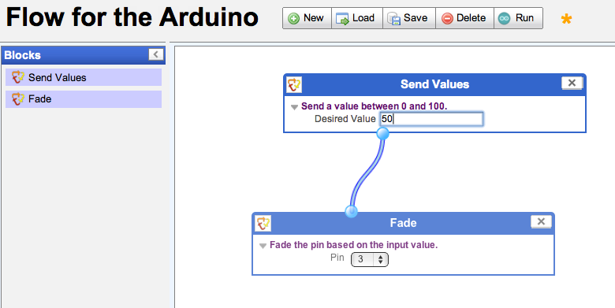
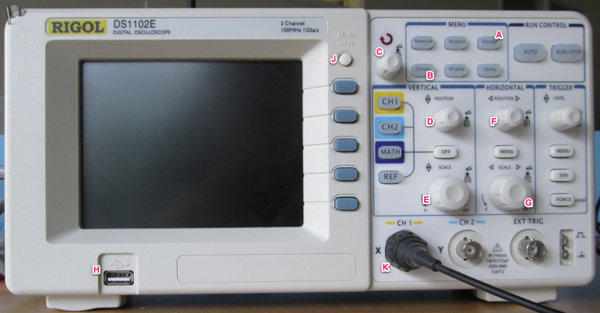

# Oscilloscope Basics

The purposes of the oscilloscope basics lab is twofold:

1. **To become aquainted with the oscilloscope**.  
   Specifically, we will learn to measure parts of a time-varying signal, save data from our oscilloscope, and then use common tools (Excel or Google Spreadsheets) to analyze that data.
1. **To work on our written communication skills in a formal context.**  
   Because the lab does not involve any unstructured, creative components, it will allow us to focus on professional writing and reporting skills in a straightforward way.

#### Materials

1. Laptop
1. Oscilloscope (we are using the Rigol 1102E)
1. Lab Notebook
1. Writing Utensils
1. USB stick (provided)

### Before You Begin

You should have watched the video [How to Use an Oscilloscope](http://www.youtube.com/watch?v=CzY2abWCVTY) by mjlorton on YouTube. I later found the 4-minute-long [Oscilloscope Tutorial Part 2 - Basic usage](http://www.youtube.com/watch?v=hUIgAu3QQWQ&feature=plcp&list=SPCADC2B237AFE4689) by AfrotechMods to be concise and useful as well.

## Get The Software

For this part of the lab, you'll want to download and install [Flow]({{site.url}}/software/flow.html), the programming environment that we will be using all semester. Because this software was 1) written this summer and 2) written by me, we may need to download it again sometime in the future. 

Please create a folder on your C:\ drive called:

<pre>
	C:\Flow
</pre>

and unzip the application there. For a variety of reasons, you must put Flow somewhere that has no spaces in its name.

## Build the Circuit

Today's circuit involves a single LED and a single resistor. We're going to be setting it to different levels of brightness with our software.

If you look at the circuit on the breadboard, it will look like this:

  

Another way to look at this circuit is as a *schematic*. Look at both the Fritzing diagram (above) and the schematic (below) and compare-and-contrast what you see. Can you find the LED? The resistor? The connections to the Arduino? Can you extract enough information from the schematic to build the circuit? (You should be able to.)

  

## Your First Program

Go back to where you downloaded and unzipped Flow, plug in your Freeduino, and you can then run the program <code>Flow.exe</code>. This will launch a small window:

  

1. You want to make sure that you see a port name in the first drop-down (this is your Freeduino).
1. You want to make sure you have selected **Freeduino** in the "Type" selector.
1. Make sure you select the **Fading** block set.

**Note**: Flow has a notion of "block sets." These allow us to focus on just the programming elements that we need for the task at hand. For example, the "Fading" blockset only has two blocks, because that's all we need for this lab.

Click "Launch," and a web browser will pop open. In your browser, you can write your first Flow program. 

  

On the left-hand side are the blocks that you can use to create your program. Drag them out onto the canvas in the middle. Then, click-and-drag to wire blocks together. In our circuits, wires carry electrical current; in our Flow programs, wires carry information and signals from one program block to another. When we run our Flow program, every block runs concurrently, transmitting information from one block to another to make our Freeduinos do interesting things.

Experiment with changing the values in the first block ("Send Values"), hit run, and see what happens in your circuit. Make note of these behaviors in your lab notebook.

## Parts of the Scope

With your partner, discuss the front of the scope. What parts matter, or are likely to be critical in this lab? What parts are you uncertain about? 

  

In your lab notebook, sketch the front of the scope, and label the parts of the scope that are marked in the picture. You will, over time, need to be comfortable with what all of these parts do.

### Measure The Signal

1. With your oscilloscope, connect the ground clip to the "low side" of the circuit, or (if you prefer), the LED leg that is connected to ground. Connect the probe clip to the "high side" of the circuit, or the leg that is connected (through the resistor) to pin 3.
1. Adjust the position and scale of the signal so that you can easily read it from top-to-bottom and left-to-right.
1. Using the vertical divisions, measure the voltage of the waveform from peak-to-valley.
1. Using the horizontal divisions, measure the period of the waveform. 
1. Using the horizontal divisions, measure how long the waveform is high (5V), and how long it is low (0V).

Record your findings in your lab notebook for values of 25, 50, and 75 in your Flow program. (That is, set the value, hit run, do your readings, and then repeat that process for each of the given values.)

### Measure the Signal, More Accurately

As above, for the values 25, 50, and 75:

1. Use the "CURSOR" function on the oscilloscope to get a cursor that lets you measure horizontal values.
1. Position the cursor at the start of the signal's period.
1. Position the cursor at the end of the signal's period.
1. Subtract the start from the end, and record that in your lab notebook.
1. Position the cursor at the start of the high voltage (the "rising edge").
1. Position the cursor at the end of the high voltage (the "falling edge").
1. Subtract the start from the end, and record the amount of time (in microseconds) the signal is "high."
1. Repeat the process for the "low" (or 0V) portion of the signal.

### Save the Data (Most Accurate)

In this experiment, we will be saving data from the oscilloscope onto a USB stick, and then opening that data in Microsoft Excel to look at it. Repeat for values of 25, 50, and 75 in Flow:

1. Use the STORAGE function on your scope to enter the STORAGE menu.
1. Choose your output type: you do not want WAVEFORM, but instead want CSV.
1. Insert your USB stick.
1. Select "External" from the STORAGE menu.
1. Save your data to the USB stick.

Repeat this process for each value, then (in Excel), open each CSV file. Plot your two columns of data as a line chart. 

1. For each line chart, find where the value changes from low to high (the rising edge). There will be many---just find one.
1. Put a mark in the cell next to the data. (If the data is in columns A and B, put a mark in column C.)
1. Find the point where the signal drops low (the falling edge). Mark that row.
1. Subtract the "Seconds" value (column A) for the start point from the "Seconds" value from the end point. This will give you a precise measure of how long the signal was high.
1. Repeat for the low region.

Record these values in your lab notebook.

### Save a Picture

In the STORAGE menu, change the output type to "Bitmap." Save a picture of your waveform to your USB stick. Do this for each of the three values, 25, 50, and 75. This way, when you write about the waveforms, you have pictures of each of the three.

## Writeup

At this point, you have used your oscilloscope to:

1. Measure a signal by looking at the display (using the divisions).
1. Measure a signal with the cursor, on-screen.
1. Measure a signal by exporting data, and calculating in Excel.
1. Capture an image of a waveform and store it for use in subsequent reporting.

For Friday, you are responsible (individually) for writing up one small sections of what will become a full report. Specifically, I would like you to discuss (compare and contrast) the relative merits of capturing data from the oscilloscope for each of the three methods we employed above. Your discussion should attempt to communicate (numerically, where possible) the limits of the accuracy of each method. How much error is possible in the first, second, and third approaches?

(For clarity, the "three approaches" are 1) reading the divisions on-screen, 2) using the cursor, and 3) capturing the data to Excel.)

**Your writeup should be in Moodle by noon on Monday.**

<!-- 
**Note**: It is possible we will require time on Friday to complete this lab. If that is the case, then the workshopping will take place on Monday. We will know whether this is the case at the end of the class on Wednesday. I will update this page accordingly at that point.
-->

## Workshopping

I will have printed copies for use in class on Monday. In class, we will go through a series of small-group reading and writing excercises in which we critique and improve our writing.

### Submission

As with all assignments, you should submit your work to [Moodle](http://moodle.berea.edu/mod/assignment/view.php?id=54287). And, as with all assignments, you should use a sensible filename:

* It should start with your username, which...
* should be followed by a hyphen, which...
* should be followed by the name of the assignment.

For example, I might name my report **jadudm-scopebasics.docx**, or possibly **jadudm-scopelab.docx**, or really anything that matches the pattern **USERNAME-ASSIGNMENT.docx** and will be obvious to both myself and a TA. Use your judgement and name your file in a way that communicates clearly the its contents.

