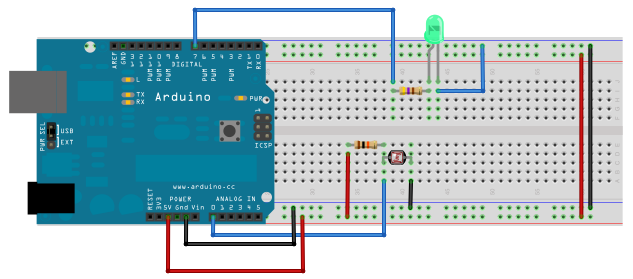
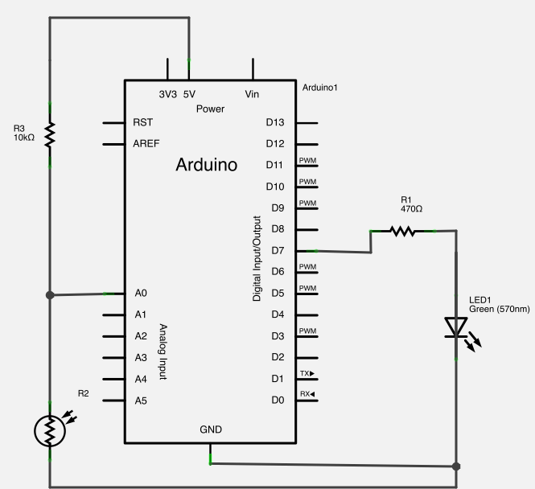
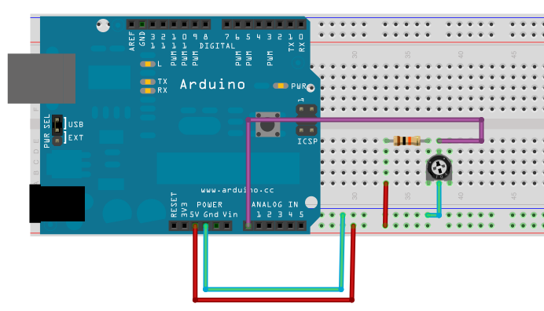
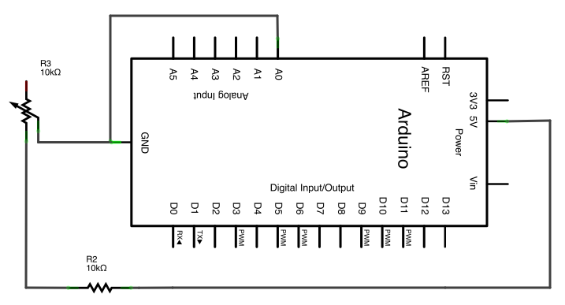
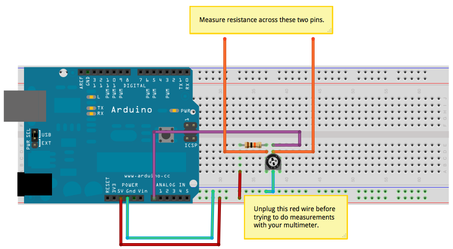

# Trimpots and Multimeters

The purposes of the trimpot lab is threefold:

1. **To see how we can automatically control our environment with simple sensors**.  
   The photocell (sometimes called an "LDR", or "light-dependent resistor") is a very simple sensor that is used widely around the world.
1. **To become familiar with the multimeter.**  
   The multimeter is one of the simplest, but most powerful tools we have available to us as practitioners of electronics. Here, we will use it to measure resistance.
1. **To practice building circuits, plotting data, and using Ohms Law.** 
   We will build a simple circuit and then plot data that we collect regarding that circuit. This will lead us to looking at Ohm's Law and how it relates to the data we collected.

#### Materials

1. Laptop
1. Multimeter (in the toolbox)
1. Lab Notebook
1. Writing Utensils

## Controlling the Lights

First, lets see where we're going. We're going to start by building a circuit and writing a program that controls whether an LED is on based on how bright it is outside.

### The Circuit

First, use the following Fritzing diagram and schematic to build a circuit on your breadboard.

  

  

### The Code

Launch Flow, and use the "Sensing Light" blockset. This has the blocks you need for this particular lab. Think about how they might go together, and experiment along with your partner to put together a program that makes sense to you.

You want a program that turns on your LED when it gets dark. You may need to experiment with the sensor and see how the values change as the light level changes.

**HINT**: You might want to use the "Print and Pass Through" block to see what values are being produced by your sensor.

### Demonstration!

Once you have things working, demonstrate your working circuit for Matt before proceeding. Our goal in this lab is to understand this circuit more fully.

## Using The Multimeter

Now, we want to substitute our variable resistor (or trim potentiometer, or "trimpot") for the light dependent resistor (photocell).

  

  

### Data Collection

Now that we're up-and-running with our circuit, it's time to collect some data. We're going to do the following:

1. Write a program that takes a reading from the sensor and prints its value to the computer.
1. Dial in a value... that is, look at where the value stabilizes.
1. Write that down.
1. Disconnect the marked wire (below).
1. Take a reading across the two orange wires with your multimeter. This is the resistance of the trimpot.
1. Repeat from step 2.

Now, here's the trick... when you want to measure the resistance, we have to break the circuit. Otherwise, we'll be measuring the resistance of the whole circuit, and that just doesn't work...

  

Create a table of 8--10 values... more values will give you a better chart in the end.

### Data Plotting

Create a graph with:

1. Resistance on the Y-axis (vertical).
1. The value you read from the sensor on the X-axis (horizontal).

Draw a line (with a straightedge) that seems to best fit those data points.

# Check In

At this point, you should have some data regarding the resistance of the trimpot with respect to the sensor readings we found along the way. 

### Submission

As with all assignments, you should submit your work to [Moodle](http://moodle.berea.edu/mod/assignment/view.php?id=55247). And, as with all assignments, you should use a sensible filename:

* It should start with your username, which...
* should be followed by a hyphen, which...
* should be followed by the name of the assignment.

For this lab, upload a document that ...

For example, I would name my report **jadudm-multimeter-one.docx**.

