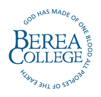
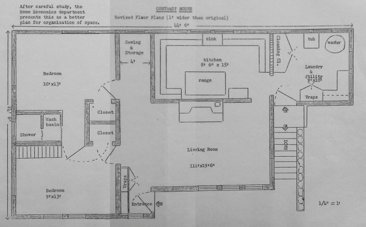
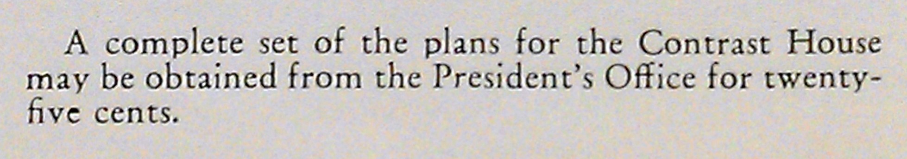

# A Model House

Berea College, in conjunction with [MakeCNC](http://makecnc.com/), is happy to
present a model of the Berea Contrast House that you can cut and build
yourself. The plans for this house are free and open, and were originally
developed to be a fundamental part of *Craft of Electronics*, a first course in
electricity and electronics at Berea College.

# Berea College

Berea College ([www](http://berea.edu/), [wiki](http://en.wikipedia.org/wiki/Berea_College)) is a liberal arts college, founded in 1855 in Berea, Kentucky. Since its founding by abolitionist John Fee, Berea has admitted all people, and today provides tuition-free education for over 1,500 students. 

# The Contrast House

The Berea Contrast House has a rich and complex history in the Appalachian
region. The Contrast House was a product of Berea College, likely suggested by
Miss Mary Beatty Brady of the Harmon Foundation in the early 1930's. <a
href="http://bereapedia.wikispaces.com/Contrast+House">1</a> In his 1936
annual report, President William J. Hutchins wrote that "One of the supreme
contributions of Berea College to the mountains must be the improvement of the
home," and although costs overran (due to labor, etc.), the materials cost of
the original Contrast House was just $650. It is interesting to note that, at
the same time, architect Frank Lloyd Wright was completing a [private home in
Madison, Wisconsin](http://www.usonia1.com/) that was to cost under $5,000... nearly ten times the cost
of a Contrast House.

In the booklet "Glimpses of Berea College," we can see photographs of the
completed Contrast House. It was a simple structure, approximately 20 feet by
44 feet, with two bedrooms, a living room, kitchen, and laundry. At $650 in materials, the Berea Contrast House cost approximately $0.74 per square foot.

Although it is difficult to imagine a Contrast House being built in the middle
of Manhattan island in New York City, we can compare the Contrast House to an
apartment in the 300-block of Central Park West. It is not uncommon for
apartments to cost hundreds of thousands of dollars; for example, an
849 sq. ft. apartment would, in 2012, set you back $835,000, costing approximately $983.51 per square foot.

Despite the fact that half a century has
passed, the plans developed by [MakeCNC](http://makecnc.com/) cost less today
than the original plans for the Contrast House. We are making plans that you can cut out by hand (or, ideally, with a CNC laser or router) available for download for free.

The original plans, for the record, cost $0.25.

# Build Your Own

Through the generosity of Paul and Julie Campbell at
[MakeCNC](http://makecnc.com/) and his collaborators ..., ..., and Berea
College, we are proud to bring you a model of the Berea Contrast House that you
can build yourself. This model is designed to be cut from a variety of
materials (wood, acrylic, and eco-friendly cardboard). 

### References

* [The Contrast House](http://bereapedia.wikispaces.com/Contrast+House) at the Bereapedia.
* [History and Mission](http://www.berea.edu/peopleservices/employeehandbook/introduction/hmbc.asp) of Berea College.
* [The Contrast House](http://cdm272901.cdmhost.com/cdm/singleitem/collection/p272901coll11/id/1531/rec/3) in the Berea College Archives.

