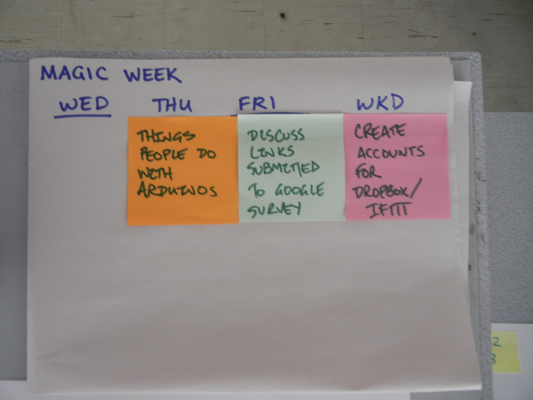

<table>
<tr>
	<td> <a href="http://www.youtube.com/watch?v=MoeqlU-kzBg">&lt;&lt; prev</a> </td>
	<td> <a href="#Wednesday">Wednesday</a> </td>
	<td> <a href="#Thursday">Thursday</a> </td>
	<td> <a href="#Friday">Friday</a> </td>
	<td> <a href="#SatSun">Weekend</a> </td>
	<td> <a href="w02.html">next &gt;&gt;</a> </td>
</tr></table>

# Week 1

## Wednesday

*Retrospective (20120823)*: On Wednesday, we had an overview of what we'll be doing this semester, and then spent 1.5 hours cleaning and organizing the lab. You did a great job---I loved that everyone dove in and just "got on with it." 

This is the spirit I hope we bring to the entire class. If you bring that energy to every new learning activity this semester, you'll be an incredible and unstoppable force by the time we're done.

## Thursday

Read [Plush Monsters: Creatures with Character](http://dlnmh9ip6v2uc.cloudfront.net/learn/materials/28/monsters.pdf) (PDF) so that you're ready for lab on Friday.

## Friday

Dive in. Build a monster. We will continue this on [Wednesday](w01.html#Wednesday) of next week.

<h2 id="SatSun">Weekend</h2>

[Assignment One: Learning to Fail]({{site.base}}/assignments/learning-to-fail.html)

This video by Jeri Ellsworth gives us a few things to think about regarding how we approach work and learning. Watch, reflect, and answer a few questions in response.

# Planning Document

For archival purposes, this is the original planning document for this week.

 
	

