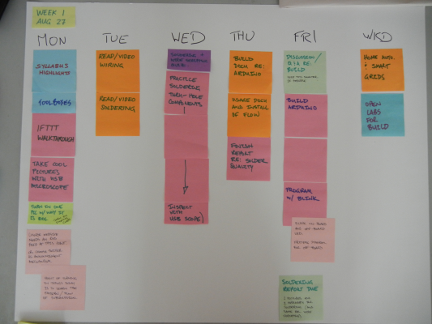

<table>
<tr>
	<td> <a href="w00.html">&lt;&lt; prev</a> </td>
	<td> <a href="#Monday">Monday</a> </td>
	<td> <a href="#Tuesday">Tuesday</a> </td>
	<td> <a href="#Wednesday">Wednesday</a> </td>
	<td> <a href="#Thursday">Thursday</a> </td>
	<td> <a href="#Friday">Friday</a> </td>
	<td> <a href="#Weekend">Weekend</a> </td>
	<td> <a href="w02.html">next &gt;&gt;</a> </td>
</tr></table>

# Week 2

## Monday

1. Q & A (0+ min)  
1. Prep Quiz (5 min)  
1. Discuss and Compare (10 min)  
1. Solutions + Q & A (30 min)  
1. Syllabus Overview (30 min)  
1. Documenting the Build (20m)  

## Tuesday

[Preparation: Learn to Solder]({{site.base}}/assignments/learn-to-solder.html).

You'll want to watch and read in preparation for class on Friday. This assignment is broken up into pieces: some for Tuesday, some for Wednesday, and some for Thursday.

## Wednesday

### In Class
1. Documenting your Work (5m)  
1. [IFTTT]({{site.url}}/assignments/automating-the-internet.html) (10min)  
1. [Plushie Wrapup]({{site.url}}/assignments/plushie-monster-writeup.html)  

In class, we'll finish making our monsters, and you might get started on the [Plushie Monster Writeup]({{site.url}}/assignments/plushie-monster-writeup.html).

### Homework
Continue with [Preparation: Learn to Solder]({{site.base}}/assignments/learn-to-solder.html).

## Thursday

Continue with [Preparation: Learn to Solder]({{site.base}}/assignments/learn-to-solder.html).

## Friday

1. Get signed off for safety/competence. (Use practice boards.)
1. [Build your Freeduino](http://www.youtube.com/playlist?list=PLDDC57FBF3063BEFF).

## Weekend

Plushie Report. (Requirements/specifications coming shortly.)

# Planning Document

For archival purposes, this is the original planning document for this week.

 
	

