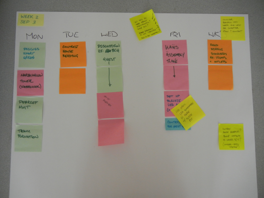

<table>
<tr>
	<td> <a href="w01.html">&lt;&lt; prev</a> </td>
	<td> <a href="#Monday">Monday</a> </td>
	<td> <a href="#Tuesday">Tuesday</a> </td>
	<td> <a href="#Wednesday">Wednesday</a> </td>
	<td> <a href="#Thursday">Thursday</a> </td>
	<td> <a href="#Friday">Friday</a> </td>
	<td> <a href="#Weekend">Weekend</a> </td>
	<td> <a href="w03.html">next &gt;&gt;</a> </td>
</tr></table>

# Week 3

There are two big themes in week three: building our Freeduino, a microcontroller that we will learn to program, and beginning to learn how to design a wiring plan for a small home. 

There are reading and writing activities to be done throughout the week, in addition to your [Plushie Monster Writeup]({{site.url}}/assignments/plushie-monster-writeup.html) being due on Friday. If you work consistently throughout the week, you won't be crushed come Thursday.

## Monday

**Materials Needed**: Laptop, Freeduino (distributed in class).

You should bring your laptop and be prepared to start working on your [Freeduino]({{site.url}}/assignments/freeduino-build.html) with a partner. The entire period is given over to getting started and (ideally) finishing your Freeduino build.

## Tuesday

I have two pieces of reading for you:

1. [Background on Home Electricity](http://www.thecircuitdetective.com/bkgrd.htm).  
Your first reading will provide a background on home electricity. Because this is the first serious reading you've done on this topic, there are going to be many things that are new to you.
1. [Physiological Effects of Electricity](http://www.allaboutcircuits.com/vol_1/chpt_3/2.html). (Section 3.1 in [the PDF](http://www.allaboutcircuits.com/pdf/DC.pdf).)

The first reading provides an overview of how electricity makes its way into a home. The second reading covers what happens when you get zapped. You can also [download the second reading as a PDF](http://www.allaboutcircuits.com/pdf/DC.pdf) if you prefer, and simply read the marked section. 

## Wednesday

**Materials Needed**: Laptop, "Unknown Terms", Freeduino

### In Class

1. Reading Q&A (5m)
1. Reading Quiz (10m)
1. Home Furnishings (15m)
1. Collaborative Reading (~ 45m)
1. Freeduino Build (Contd.) (?)

### Quiz 

We will begin with a quiz on the prior reading.

### Collaborative Reading

We will be doing an exercise in class that I call "collaborative reading." I have titled this exercise [Exploring Home Wiring Planning]({{site.url}}/assignments/exploring-home-wiring-planning.md), and that link will tell you more about what we will be doing in class.

### Freeduino Build

We may, or may not, spend more time building our Freeduinos today.

### Homework

See the homework described in the [Exploring Home Wiring Planning]({{site.url}}/assignments/exploring-home-wiring-planning.md) exercise.

## Thursday

Read [Shock Current Path](http://www.allaboutcircuits.com/vol_1/chpt_3/3.html), which talks about how we end up getting zapped. This reading comes from [All About Circuits](http://www.allaboutcircuits.com/), a freely available textbook on electricity and electronics. (Section 3.2 in [the PDF](http://www.allaboutcircuits.com/pdf/DC.pdf).)

## Friday

1. Reading Discussion (5-10m)
1. Freeduino Build
1. Freeduino Test

We should be able to complete our Freeduinos today, and then test them before we leave for the weekend.

## Weekend

TBA. I want to see where we get to on Wednesday before I post the weekend homework. You can expect some reading and work related to your home wiring diagram, as well as some preparation regarding programming your Freeduino. This will be announced before Thursday.

### Historical Record

These are the planning documents developed during the summer of 2012 that guided this (and future) weeks.

 
	

