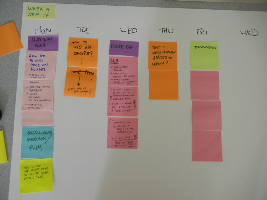

<table>
<tr>
	<td> <a href="w03.html">&lt;&lt; prev</a> </td>
	<td> <a href="#monday">Monday</a> </td>
	<td> <a href="#tuesday">Tuesday</a> </td>
	<td> <a href="#wednesday">Wednesday</a> </td>
	<td> <a href="#thursday">Thursday</a> </td>
	<td> <a href="#friday">Friday</a> </td>
	<td> <a href="#weekend">Weekend</a> </td>
	<td> <a href="w05.html">next &gt;&gt;</a> </td>
</tr></table>

# Week 5

## Monday

## Tuesday

## Wednesday

## Thursday

## Friday

We'll be doing three things today:

1. **Workshopping**. We're going to look at our Plushie reflections, and begin developing a shared understanding of what it means to do excellent work. Then, we'll do some editing and writing on the spot with each-other's help.
1. **Datasheets**. Next, we'll take our first dive into a datasheet, because we'll see more of them in the future. And, specifically, we'll look at an [LED datasheet]({{site.url}}/downloads/diode-datasheet.pdf) (PDF).
1. **Writing**. With the time remaining, you're free to work on your [oscilloscope writeup]({{site.url}}/assignments/oscilloscope-basics.html).

## Weekend

1. **Writeup due**. On Monday, we're going to submit our oscilloscope writeups. Please have them in before class.
1. **Reading**. Please read pages 42--47 and 66--69 in the Mims. (Or, if you prefer, "Getting Started with Electronics.") This is about diodes and LEDs. There will be a short quiz, as is always the case after a reading.

## History

 
	

