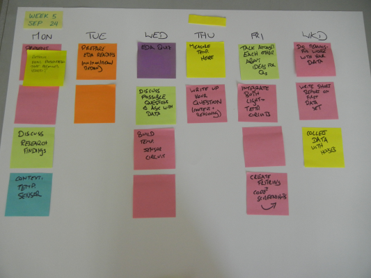

<table>
<tr>
	<td> <a href="w04.html">&lt;&lt; prev</a> </td>
	<td> <a href="#monday">Monday</a> </td>
	<td> <a href="#tuesday">Tuesday</a> </td>
	<td> <a href="#wednesday">Wednesday</a> </td>
	<td> <a href="#thursday">Thursday</a> </td>
	<td> <a href="#friday">Friday</a> </td>
	<td> <a href="#weekend">Weekend</a> </td>
	<td> <a href="w06.html">next &gt;&gt;</a> </td>
</tr></table>

# Week 6

## Monday

**Required Materials**: Laptop, Freeduino, Breadboard + Jumpers

* **Q & A**: If you have questions, we start there.
* **Quiz**: Then the quiz. Solo first, followed by pair.
* **Lab Intro**: The [LIFX Bulb](http://www.kickstarter.com/projects/limemouse/lifx-the-light-bulb-reinvented).
* **Lab**: [Potentiometers and Multimeters]({{site.url}}/assignments/trimpots-and-multimeters.html)

**Before leaving**: You should be checked out by Matt. The lab says more.

## Tuesday

**Homework**: Practice solving the V=IR equation. 

1. You can [Download a PDF]({{site.url}}/downloads/20120924-ohms-law-practice.pdf) of the problem set.
1. You can also [view a pencast]({{site.url}}/downloads/20120924-ohms-law-pencast.pdf) (requires a current version of Acrobat Reader) that provides an example of how to use Ohm's Law to solve the problems in this practice problem set.

I want to take a minute to mention one or two things about *practice*. The [American Psychological Association has a few things to say](http://www.apa.org/education/k12/practice-acquisition.aspx) about the role of practice and learning. First, this quote:

> Deliberate practice consists of activities purposely designed to improve performance. These activities typically require effort and are not enjoyable. Most students are incapable of working on practice activities for long periods of time (Gobet & Campitelli, 2007, p. 160).

Gobet and Campitelli tell us two important things in this short quote:

1. Practice is supposed to help you improve.
1. Practice is only valuable in short bursts.

Further, there are 5 reasons given why practice is important:

> Practice is important for teaching and learning in at least five ways:
>
> 1. Practice greatly increases the likelihood that students will permanently remember new information that they encounter by transferring it into their knowledge base.
> 1. Practice increases student facility or automaticity (automaticity means learning to apply elements of knowledge automatically, without reflection). Automaticity is usually only achieved through extensive rehearsal and repetition. Automaticity frees up students' cognitive resources to handle more challenging tasks.
> 1. When students practice solving problems, it appears that they increase their ability to transfer practiced skills to new and more complex problems (Glover, Ronning, & Bruning, 1990).
> 1. Practice helps students acquire expertise in subject matter and therefore it helps to distinguish novices from experts in given subjects.
> 1. Cognitive gains from practice often bring about motivation for more learning (Kalchman, Moss, & Case, 2001).
> 
> Teachers should think of practice not as rote repetition, but as deliberate, goal-directed rehearsal paired with reflection on problem-solving processes.

You can [read more about practice online](http://www.apa.org/education/k12/practice-acquisition.aspx); you don't have to, but I wanted you to know that I have my reasons and motivations for practicing things.

## Wednesday

**Required Materials**: Laptop, Freeduino, Breadboard + Jumpers

## Thursday

## Friday

Introduction to voltage dividers.

## Weekend

These pencasts explore the mathematics we did in class on Friday. I work three problems, step-by-step, so you can follow along. 

* [Voltage Dividers 1]({{site.url}}/downloads/20120929-voltage-dividers-01-pencast.pdf)
* [Voltage Dividers 2]({{site.url}}/downloads/20120929-voltage-dividers-02-pencast.pdf)
* [Voltage Dividers 3]({{site.url}}/downloads/20120929-voltage-dividers-03-pencast.pdf)

Remember, you need to download these and use Acrobat to view them.

#### How To Use The Pencasts

**Just watching will not help you learn.** If this material confuses you, you need to actually put pen to paper and do the problems along with me. 

After you're done with these problems, download the [Voltage Dividers!](http://goo.gl/C0aoo) app. This Windows program will let you practice problems involving voltage dividers. It assumes two resistors (R1 and R2), and asks you to report the voltage drop that would take place across of each of those resistors. At any point, you can click the **Brag to Matt** button and report your score to me. 

My ask: aspire to getting 15 or 20 right. You should be able to do these without difficulty. At that point, you will be ready for the next step.

I am available for office hours, and you might also consider coming in to work with a TA during the open lab times (7:30PM - 9:00PM, Sunday through Thursday).

(If the link above didn't work for downloading the app, try [this one](http://jadud.com/people/mcj/files/voltage-dividers.zip).)

## History

 
	

