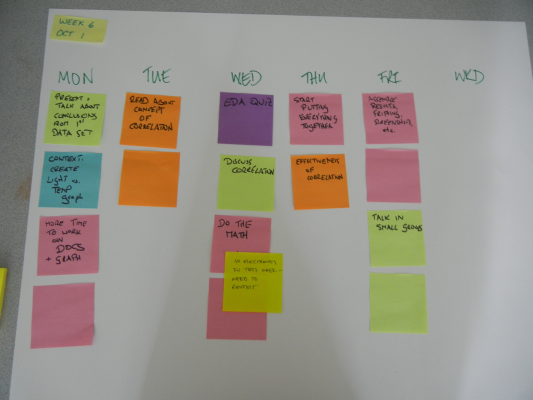

<table>
<tr>
	<td> <a href="w05.html">&lt;&lt; prev</a> </td>
	<td> <a href="#monday">Monday</a> </td>
	<td> <a href="#tuesday">Tuesday</a> </td>
	<td> <a href="#wednesday">Wednesday</a> </td>
	<td> <a href="#thursday">Thursday</a> </td>
	<td> <a href="#friday">Friday</a> </td>
	<td> <a href="#weekend">Weekend</a> </td>
	<td> <a href="w08.html">next &gt;&gt;</a> </td>
</tr></table>

# Week 7

## Monday

**Required Materials**: Laptop

We'll start with a brief review of voltage divider material. In particular:

1. Voltage dividers in context... why do we care about dividers?
1. Voltage dividers the easy way... on paper.

Then, we'll update our VMs. Again. Along the way, I'll talk about how to care for your computer.

## Tuesday

Practice using the [tabular method for solving voltage divider problems in series circuits](http://www.allaboutcircuits.com/vol_1/chpt_5/2.html), and [read about parallel circuits](http://www.allaboutcircuits.com/vol_1/chpt_5/3.html). 

I have [linked several pencasts about voltage dividers]({{site.url}}/2012/10/02/voltage-dividers.html) in that you might find useful.

Come in Wednesday with questions.

## Wednesday

**Required Materials**: Laptop

1. We'll start with questions from the reading.
1. Intro to parallel circuits.
1. House : Hang lights.

## Thursday

Review for [practice exam]({{site.url}}/2012/10/03/first-exam-contents.html).

## Friday

**Required Materials**: You, pencil or pen.

Friday will be a practice exam. A pencast of the solutions will be provided (and linked in at the end of the day). You may discuss the exam with others, and you are **very strongly encouraged** to ask questions. My recommendation is the following:

1. Read the entire exam. Allow 10 minutes for this.
1. Work the exam alone. (1h 15m)
1. Work with your table and look at the problems that gave you the most difficulty. Help each-other identify how to tackle those problems. (20m)
1. As a class, collect any outstanding questions in an email, and send them to me. (10m)

I will post a pencast with the solutions on Saturday, and do my best to address any outstanding questions. 

## Weekend

I suspect you might not complete the practice exam during class. This is known/intentional.

I say it is "intentional" because you have a 4-day weekend to work these problems and ask questions. I recommend you read, work problems, and email questions to me as you need to. I will answer in writing and/or via pencasts as is appropriate.

## History

 
	

