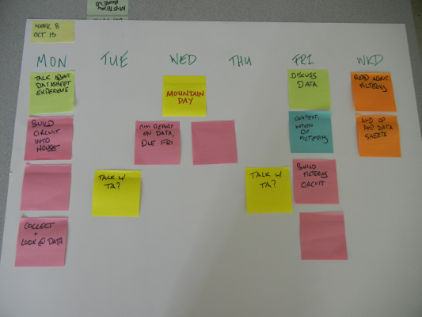

<table>
<tr>
	<td> <a href="w06.html">&lt;&lt; prev</a> </td>
	<td> <a href="#monday">Monday</a> </td>
	<td> <a href="#tuesday">Tuesday</a> </td>
	<td> <a href="#wednesday">Wednesday</a> </td>
	<td> <a href="#thursday">Thursday</a> </td>
	<td> <a href="#friday">Friday</a> </td>
	<td> <a href="#weekend">Weekend</a> </td>
	<!-- ><td> <a href="w09.html">next &gt;&gt;</a> </td> -->
</tr></table>

# Week 9

## Monday

Today we'll do two things. 

1. **Exam Question and Answer**. If you have any questions regarding the exam we just took, this would be the time to ask. Everything gets passed back, midterm feedback goes out tonight.
1. **Using Fritzing**. The second activity of the day is a first look at Fritzing.

## Tuesday

## Wednesday

MOUNTAIN DAY

## Thursday

## Friday

**Equipment Needed**: Laptop.

Two things for today:

1. **Excel**. We'll take a look at some basic functions in Excel for handling a single column of data, as well as how to plot that data.
1. **House Wiring Diagram**. We'll take our house wiring plan and use Fritzing to make a diagram that represents our house wiring before we go further in our construction.

## Weekend

Reading. I'll post it shortly.

## Historical Planning

Retained for posterity.

 
	

