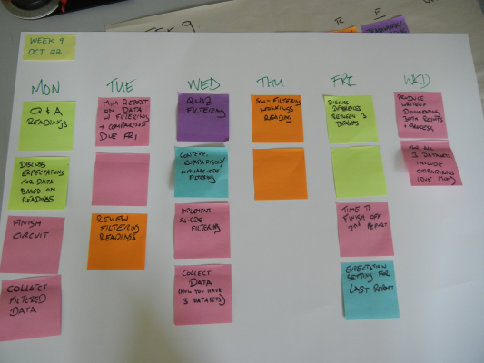

<table>
<tr>
	<td> <a href="w06.html">&lt;&lt; prev</a> </td>
	<td> <a href="#monday">Monday</a> </td>
	<td> <a href="#tuesday">Tuesday</a> </td>
	<td> <a href="#wednesday">Wednesday</a> </td>
	<td> <a href="#thursday">Thursday</a> </td>
	<td> <a href="#friday">Friday</a> </td>
	<td> <a href="#weekend">Weekend</a> </td>
	<!-- ><td> <a href="w09.html">next &gt;&gt;</a> </td> -->
</tr></table>

# Week 9

## Monday

1. [Jigsaw reading regarding thermostats]({{site.url}}/assignments/jigsaw-reading-thermostats.html) discussion.
1. [Excel basics]({{site.url}}/assignments/excel-basics.html).

## Tuesday

Read up on the [TMP37](http://shop.moderndevice.com/products/temperature-sensor). Using the [TMP37 datasheet](http://www.analog.com/static/imported-files/data_sheets/TMP35_36_37.pdf), see if you can find the information that will help you convert output voltage to temperature.

If you can, use a spreadsheet to figure out what formula we should use to convert the voltage reading we get from the sensor into a value that makes sense as a temperature (in degrees Celsius or Fahrenheit)

## Wednesday

1. Circuit build.
1. Temperature circuit test/exploration.
1. Circuit deployment.

## Thursday

## Friday

Finish building the contrast houses.

## Weekend

*TBA*.

## Historical Planning

Retained for posterity.

 
	

