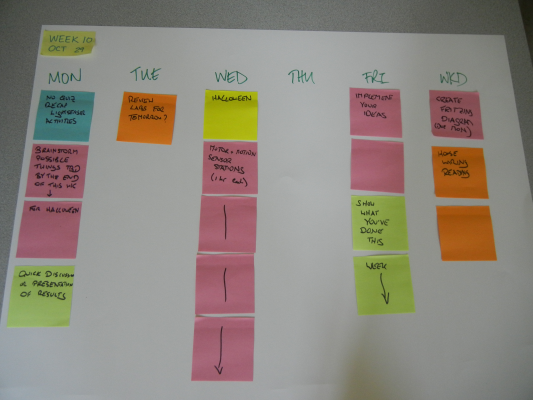

<table>
<tr>
	<td> <a href="#Monday">Monday</a> </td>
	<td> <a href="#Tuesday">Tuesday</a> </td>
	<td> <a href="#Wednesday">Wednesday</a> </td>
	<td> <a href="#Thursday">Thursday</a> </td>
	<td> <a href="#Friday">Friday</a> </td>
	<td> <a href="#Weekend">Weekend</a> </td>
</tr></table>

# Week 11

## Monday

**Work Due**: N/A

**Tools Required**: Laptop, Sensor

**For Next Class**: Reading

**In Class**: 

Today, we will do the following:

1. Collect our sensors.
1. Collect the data from our sensor.
1. Label our data, and capture images of our sensor deployments.
1. Upload/share data to Moodle.
1. Analyze *our* individual data.
1. Compare our data.

We may not get through to data comparison today; we'll see how timing goes.

## Tuesday

**To Do**: 

For Wednesday, [visit the Modern Device webpage](http://shop.moderndevice.com/products/pir-sensor) regarding the passive infrared sensor that we'll be using this week. Read about the sensor, and then read all of the material linked. Using your new-found paper reading skills, first identify which resources look most valuable. Then, focus your reading on those resources that are most valuable, and prepare for a quiz about PIR sensors based on what you think is most important.

## Wednesday

**Work Due**: Excel Work (from Friday of last week), Quiz re: PIR

**Tools Required**: Laptop

**For Next Class**: "Sensor Pseudocode" (see [Thursday](#thursday))

**In Class**:

#### For Your Consideration

The question to consider is this: *should everyone in electronics have to learn to program?*

#### Question Development

First, we will develop our questions and answers regarding PIR sensors as small groups, then as a full group.

#### PIR Preparation

Today, we will prepare our PIR (passive infrared) sensors for use on Friday. The programming ninjas were unable to have everything ready for you to deploy today.

The circuit you want to build is at the [end of LadyAda's documentation/tutorial on PIR sensors](http://www.ladyada.net/learn/sensors/pir.html). 

1. Cut one piece of 22 AWG **black** wire to 10" length.
1. Cut one piece of 22 AWG **white** wire to 10" length.
1. Cut one piece of 22 AWG **red** wire to 10" length.

Remember, we cut wire with wire cutters. Use the correct tool for the job.

Carefully strip approximately 1/4"  of shielding off of each end of the wire. Use your wire strippers. Note that the wire strippers have a gauge on the side that tells you where you should put the wire to strip it, depending on the diameter (or, if you prefer, gauge).

Observe my PIR unit. I carefully curled the end of one wire, and applied a **very small amount of solder** to hold the wire in place. I will later want to remove these wires, so we want to do a clean, neat job of attaching the wire on a temporary basis. Globbing solder everywhere, bridging pins... these are not the desired outcomes. A very tiny amount of solder---just enough to hold the wire in place and make a good electrical connection, is what we want.

After you solder your wires, set your multimeter into "continuity mode." This setting has a "sound wave" icon. Touch one end of the wire and the pin you soldered it to; you should hear a beep if you have a good electrical connection at the solder joint.

Now, bring an Arduino to me for programming. I will upload code that prepares it for reading from the PIR sensor. It will leave the LED attached to pin 13 off if there is no motion, and it will light pin 13 if there is motion. Your Arduino has an LED directly on the board that connects to pin 13, so you don't need to build any additional circuitry to test this.

Once you have a working PIR sensor, place it and your Arduino into your desk. We will integrate it into a working sensor on Friday.

## Thursday

**Homework**: 

Using Fritzing, draw a circuit with the following components:

1. An Arduino.
1. An SDLogger.
1. A PIR sensor.
1. A temperature sensor.

After you design your circuit, describe how I would need to write a program to do store the current temperature every time someone walked into the room.

Now, you might be thinking "**but I don't write code!**" Yes, this is possible. However, you are the *electronics expert*. You know what you have to do to build the circuit, and you know how you want it to work. Therefore, it is up to you to clearly communicate:

1. What devices are connected where on your Arduino, and
1. How you want the programmer to make those devices interact.

In other words, you should be able to write a very clear set of instructions (perhaps numbered) that leave no doubt as to how I, as your hired software development ninja, should write code to collect data using your sensor.

Some people might say that we are writing *pseudocode*, or "false code." I say you're trying to communicate as clearly, in as much detail as possible, about what you want your sensor to do.

## Friday

**Work Due**: "Sensor Pseudocode"

**Tools Required**: 

**Homework**: Videos, notes (see [the weekend](#weekend))

**In Class**:

Build and deploy motion + light sensor circuit.

## Weekend

**Homework**:

**This is not complete yet. --MCJ 20121031**

History and Overview: http://www.youtube.com/watch?v=ORW7Qr4Nhtk

Manufacturing: http://www.youtube.com/watch?v=t9Qwx75eg8w

How they Work: http://www.youtube.com/watch?v=IvFVu7Jxa2I&NR=1&feature=fvwp

How they Work (faster): http://www.youtube.com/watch?v=ciMxaPvEPUs&feature=related

Equation Derivation: http://www.youtube.com/watch?v=n4dW1tt9X30

## History

Planning documents preserved for history.

 
	

